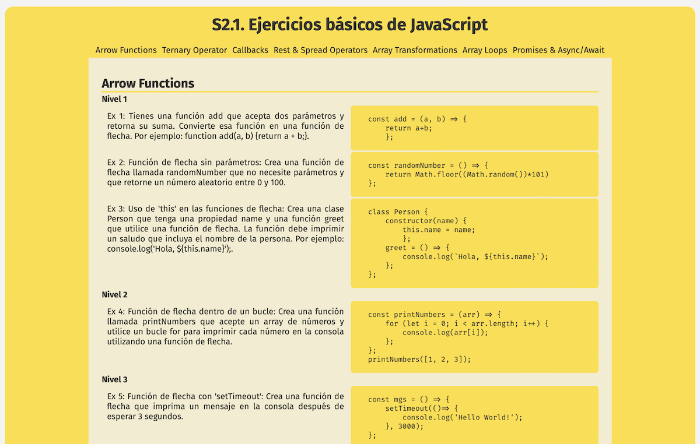

## Ejercicios básicos de JavaScript
🚀 [DEMO](https://julialchemdev.github.io/S2.1-Ejercicios-basicos-de-JavaScript/)

Desarrollado como parte del curso de React en Barcelona Activa, este proyecto tiene como propósito repasar y practicar los conceptos básicos de JavaScript.

## 📱💻 Vista en dispositivos 

## 🙌 Objetivos

 - Comprender y practicar el uso de las funciones de flecha.
 - Aprender y aplicar el operador ternario en diversos contextos.
 - Entender y practicar con callbacks.
 - Conocer y utilizar los operadores Rest y Spread.
 - Familiarizarse con los bucles y las transformaciones en arrays.

## 🚀 Funcionalidades

El proyecto contiene varios ejercicios que te permiten practicar los siguientes conceptos clave de JavaScript:

### 1. Arrow Functions
### 2. Ternary Operator
### 3. Callbacks
### 4. Rest & Spread Operators
### 5. Array Transformations
### 6. Array Loops
### 7. Promises & Async/Await

## 🛠️ Tecnologías

- **HTML**: Estructura básica para la creación de la página web.
- **CSS3**: Para estilizar el diseño.
- **JavaScript**: Implementa los ejercicios y funcionalidades interactivas utilizando JavaScript puro, incluyendo conceptos como funciones de flecha, operadores ternarios, callbacks y más.